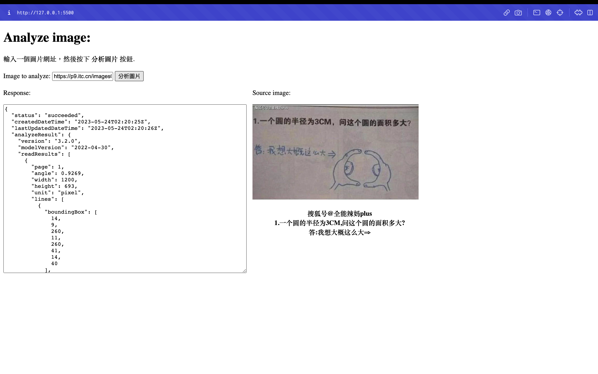

# LAT HW5 Azure's Image Recognition

## Screenshot

## Ideas and Applications
The scenarios is that university uses a lot of digital document to hand in their assignments, paper is not commonly used anymore nowadays. However, some people still used to be using pen and paper to write out their thoughts and ideas. To keep up with the school's requirements, they need a way to digitize the physical medium. The application that I write uses Azure's Computer Vision to extract the text from an images, this reduce the needs of retyping the content.

Another scenario is when students have some chinese words that don't know how to pronounce or write using pinyin/zhuyin. Students can use the same application to get the text needed from the image taken.

## Azure's Computer Vision
I'll be using the Azure's Optical Character Recognition(OCR) services in this homework.

The OCR and Read Api detects text in an image and extracts the recognized characters into a machine-usable character stream.

link: https://learn.microsoft.com/en-us/azure/cognitive-services/computer-vision/quickstarts-sdk/client-library?pivots=programming-language-rest-api&tabs=visual-studio
